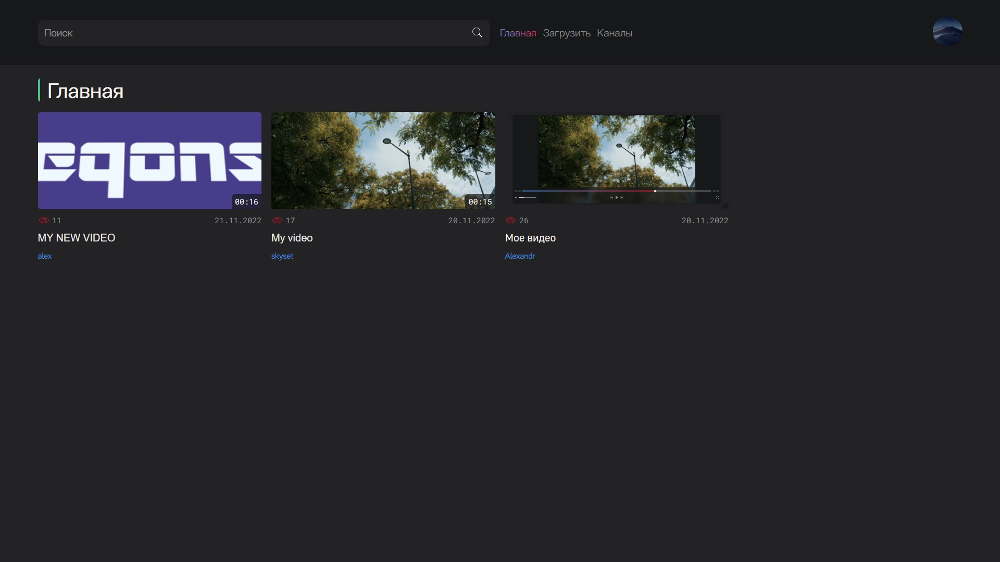
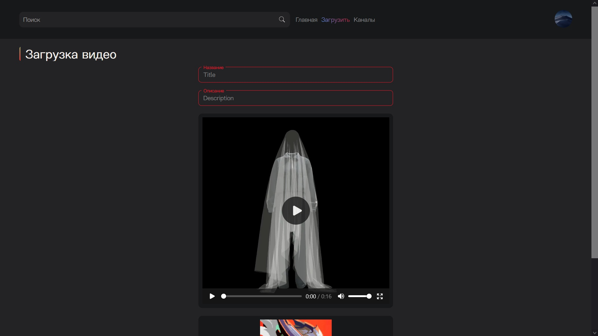
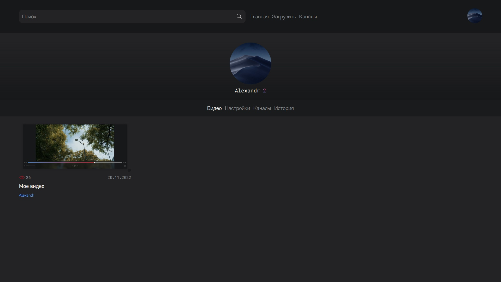
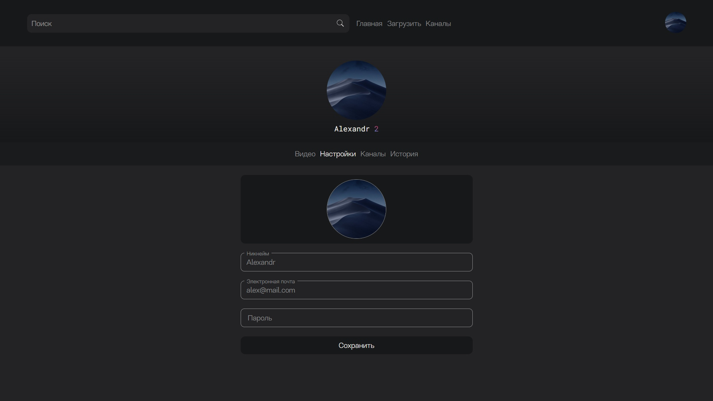
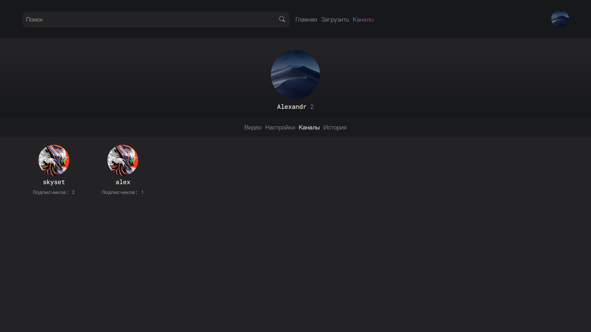
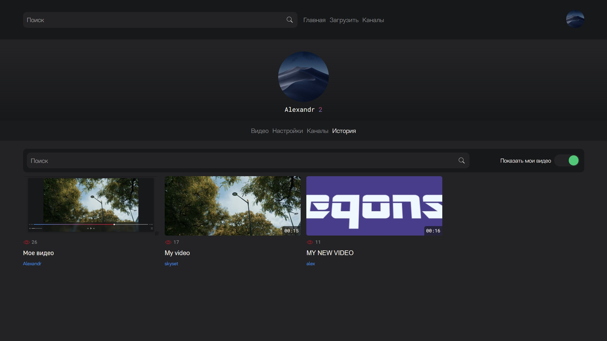
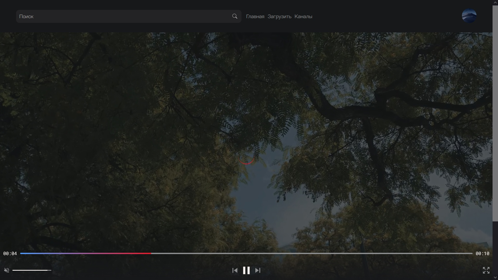
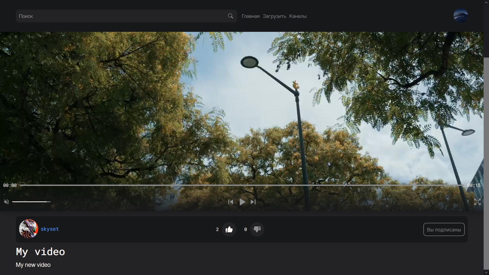

# videoPlatform

With this project, you can upload and share your own videos, as well as view and rate others

## Authorization pages


## Main page


## Load video page


## Profile videos page


## Profile settings page


## Profile followings page


## Profile history page


## Edit page


## Video page



## Build Setup

```bash
# install dependencies
$ npm install

# serve with hot reload at localhost:3000
$ npm run dev

# build for production and launch server
$ npm run build
$ npm run start

# generate static project
$ npm run generate
```